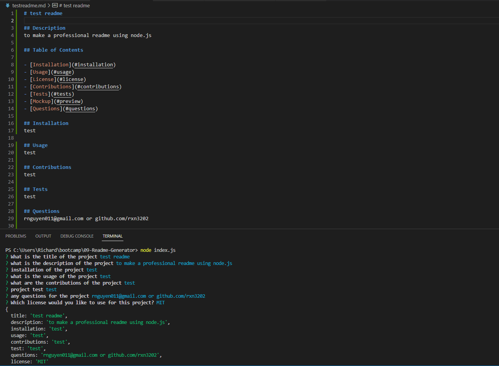

# README-Generator

## Professional README Generator Starter Code
[How to create a Professional README](https://coding-boot-camp.github.io/full-stack/github/professional-readme-guide)

## Description

The README Wizard is a user-friendly tool designed to help GitHub users generate professional README.md files for their projects effortlessly. By asking a series of questions about the project, such as its name, description, and installation instructions, the Wizard enables users to provide the necessary information. Once the user has provided the input, the application utilizes it to create a polished and comprehensive README file. This file can then be seamlessly integrated into the user's project repository, enhancing its documentation and presentation.

## User Story

AS A developer
I WANT a README generator
SO THAT I can quickly create a professional README for a new project

## Acceptance Criteria

GIVEN a command-line application that accepts user input
WHEN I am prompted for information about my application repository
THEN a high-quality, professional README.md is generated with the title of my project and sections entitled Description, Table of Contents, Installation, Usage, License, Contributing, Tests, and Questions
WHEN I enter my project title
THEN this is displayed as the title of the README
WHEN I enter a description, installation instructions, usage information, contribution guidelines, and test instructions
THEN this information is added to the sections of the README entitled Description, Installation, Usage, Contributing, and Tests
WHEN I choose a license for my application from a list of options
THEN a badge for that license is added near the top of the README and a notice is added to the section of the README entitled License that explains which license the application is covered under
WHEN I enter my GitHub username
THEN this is added to the section of the README entitled Questions, with a link to my GitHub profile
WHEN I enter my email address
THEN this is added to the section of the README entitled Questions, with instructions on how to reach me with additional questions
WHEN I click on the links in the Table of Contents
THEN I am taken to the corresponding section of the README

## Mock Up

[Video Preview](https://drive.google.com/file/d/1quFOamldADz4f7nReotqXGjbhePwkzmA/view?usp=share_link)

## Technologies Used

javascript
node.js
inquirer.js

